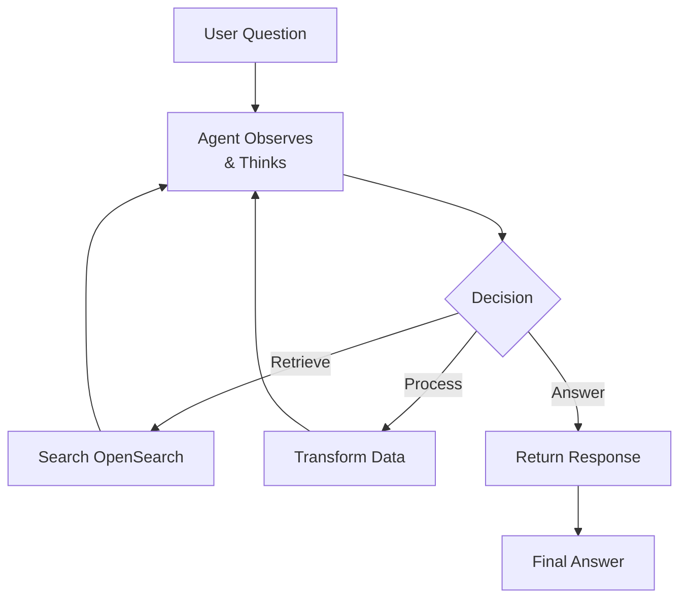
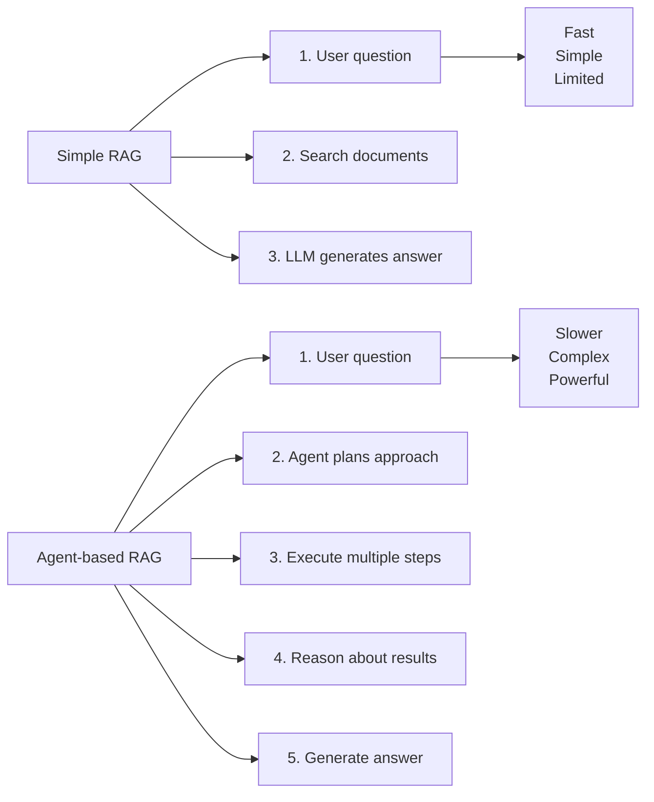

# RAG Agent Tools - Advanced LLM Orchestration

## 📚 Overview
This guide covers **RAG agent frameworks** and advanced tools for building intelligent systems that:
1. Retrieve information from OpenSearch
2. Use LLMs to process and reason
3. Execute multi-step workflows autonomously

### 🎯 Key Concepts
- **Agents**: Self-directed LLM systems with tools
- **RAG**: Retrieval-Augmented Generation
- **Non-Supported Models**: Custom/local models in pipelines

---

## 🤖 What is a RAG Agent?



---

## 📋 Agent Loop Process

```
1. USER QUERY
   ↓
2. AGENT THINKS
   - What tools do I need?
   - What's the best approach?
   ↓
3. CHOOSE ACTION
   - Search for documents
   - Process information
   - Generate response
   ↓
4. EXECUTE ACTION
   - Call OpenSearch
   - Call LLM
   - Transform data
   ↓
5. OBSERVE RESULT
   - Evaluate outcome
   - Continue or conclude?
   ↓
6. REPEAT OR ANSWER
   - If more info needed → Loop to Step 2
   - Else → Return final answer
```

---

## 🔧 RAG Agent Frameworks

### Framework 1: LangChain Agents

```python
from langchain.agents import AgentExecutor, create_react_agent
from langchain.chat_models import ChatAnthropic
from langchain.tools import Tool
from langchain.retrievers import OpenSearchRetriever

# Create tools
retriever = OpenSearchRetriever(opensearch_url="...", index="docs")

tools = [
    Tool(
        name="Search Documents",
        func=retriever.get_relevant_documents,
        description="Search for relevant documents"
    ),
    Tool(
        name="Calculator",
        func=lambda x: eval(x),
        description="Evaluate mathematical expressions"
    )
]

# Create agent
llm = ChatAnthropic(model="claude-3-opus-20240229")
agent = create_react_agent(llm, tools)
executor = AgentExecutor(agent=agent, tools=tools)

# Run
result = executor.invoke({
    "input": "What is the capital of France and how far is it from London?"
})
```

### Framework 2: LlamaIndex Agents

```python
from llama_index.agent import OpenAIAgent
from llama_index.tools import FunctionTool

# Define tools
def search_docs(query: str) -> str:
    """Search documents"""
    return retrieve_from_opensearch(query)

tools = [
    FunctionTool.from_defaults(fn=search_docs)
]

# Create agent
agent = OpenAIAgent.from_tools(
    tools,
    llm=ChatOpenAI(model="gpt-4")
)

# Run
response = agent.chat("Who won the 2024 Olympics?")
```

---

## 💡 Common Agent Patterns

### Pattern 1: Multi-Step Search

```python
# Agent decides to search multiple queries
Agent Prompt:
  "What's the largest city in Germany and its population?"

Step 1: Search "largest city Germany"
       → Finds: Berlin

Step 2: Search "Berlin population"
       → Finds: 3.5 million

Final Answer: "Berlin is the largest city..."
```

### Pattern 2: Fact Verification

```python
# Agent verifies information with multiple searches
Query: "Is Paris the capital of France?"

Step 1: Search "Paris capital"
Step 2: Search "France capital"
Step 3: Cross-reference results
Final: "Yes, confirmed Paris is France's capital"
```

### Pattern 3: Complex Reasoning

```python
# Agent chains multiple operations
Query: "Compare GDP of Paris and London"

Step 1: Search "Paris GDP"
Step 2: Search "London GDP"
Step 3: Use calculator to compare
Step 4: Format final comparison
```

---

## 📊 Agent vs Simple RAG



---

## 🎯 When to Use Agents

✅ **Use Agents When:**
- ❓ Questions require multiple steps
- 🔀 Need to combine information
- 🧠 Complex reasoning required
- 🔄 Need to iteratively refine

❌ **Don't Use Agents When:**
- ⚡ Need fast, simple answers
- 📊 Single-step retrieval sufficient
- 💰 Cost is critical concern

---

## 🔧 Building Custom Tools for Agents

```python
from langchain.tools import Tool

def opensearch_search(query: str) -> str:
    """Search OpenSearch documents"""
    results = client.search(
        index="documents",
        body={
            "query": {
                "match": {"text": query}
            }
        }
    )
    return "\n".join([
        hit["_source"]["text"]
        for hit in results["hits"]["hits"]
    ])

def calculate(expression: str) -> str:
    """Calculate mathematical expressions"""
    try:
        return str(eval(expression))
    except:
        return "Invalid expression"

tools = [
    Tool(
        name="Search OpenSearch",
        func=opensearch_search,
        description="Search for documents in OpenSearch index"
    ),
    Tool(
        name="Calculator",
        func=calculate,
        description="Calculate math expressions"
    )
]
```

---

## 📈 Advanced Topics

### Multi-Agent Systems

```python
# Multiple agents working together
agent1 = RetrievalAgent(tools=[search_tool])
agent2 = ReasoningAgent(tools=[calculator_tool])
agent3 = SynthesisAgent()

# Workflow
doc_info = agent1.run(question)
analysis = agent2.run(doc_info)
final_answer = agent3.run(analysis)
```

### Memory Management

```python
# Agents with long-term memory
from langchain.memory import ConversationBufferMemory

memory = ConversationBufferMemory()

agent = AgentExecutor(
    agent=agent,
    tools=tools,
    memory=memory,
    verbose=True
)

# Multiple turns with context
agent.invoke({"input": "What is Paris?"})
agent.invoke({"input": "How many people live there?"})  # Remembers Paris
```

---

## 🔧 Troubleshooting Agents

| Issue | Solution |
|-------|----------|
| Infinite loops | Add max steps limit |
| Poor tool choices | Improve tool descriptions |
| Slow execution | Use faster LLM or fewer tools |
| Hallucinations | Add fact-checking step |

---

## 📖 Resources

- 🔗 [LangChain Agents](https://python.langchain.com/docs/modules/agents/)
- 🔗 [LlamaIndex Agents](https://docs.llamaindex.ai/en/latest/module_guides/agents/)
- 🔗 [ReAct Paper](https://arxiv.org/abs/2210.03629)

---

## ✨ Summary

RAG Agents provide:
- ✅ **Multi-step reasoning** capabilities
- ✅ **Autonomous problem-solving**
- ✅ **Tool-use and integration**
- ✅ **Complex workflow automation**

Perfect for **enterprise intelligence systems**! 🚀

