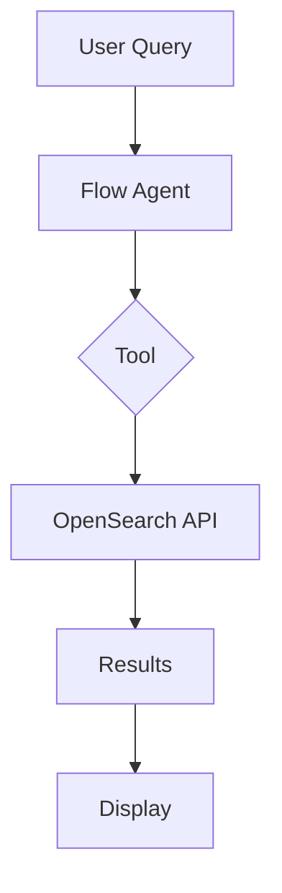
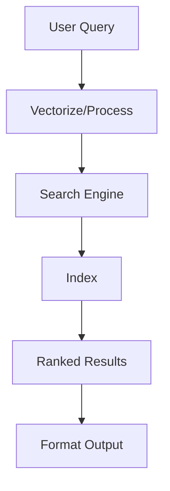
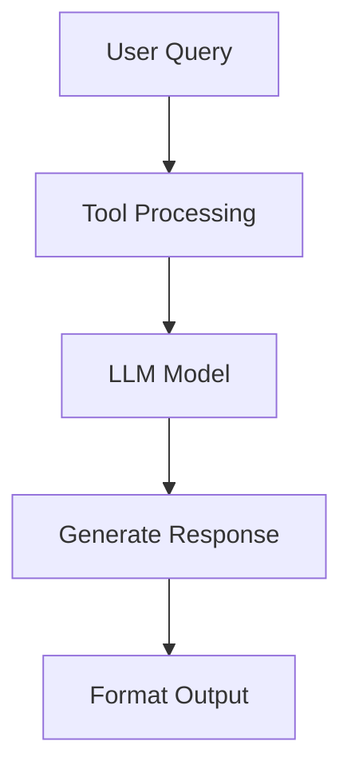
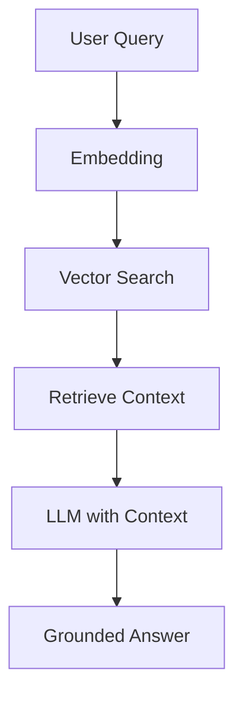

# 📚 Notebook Templates for Remaining Tools

This document provides templates for creating the remaining agent tool notebooks. Each template follows the established pattern with Mermaid diagrams, step-by-step instructions, and comprehensive examples.

## 🎨 Color Scheme Reference

```mermaid
%%{init: {'theme':'base', 'themeVariables': {
  'primaryColor':'#[TOOL_COLOR]',      // Choose unique color per tool
  'primaryTextColor':'#fff',
  'lineColor':'#F39C12',
  'secondaryColor':'#3498DB',
  'tertiaryColor':'#27AE60'
}}}%%
```

### Suggested Tool Colors:
- **AgentTool**: `#E74C3C` (Red - Agent composition)
- **DataDistributionTool**: `#3498DB` (Blue - Data analysis)
- **IndexMappingTool**: `#2ECC71` (Green - Structure info)
- **LogPatternTool**: `#F39C12` (Orange - Pattern extraction)
- **LogPatternAnalysisTool**: `#E67E22` (Dark orange - Advanced analysis)
- **MLModelTool**: `#9B59B6` (Purple - ML inference)
- **NeuralSparseSearchTool**: `#1ABC9C` (Teal - Sparse vectors)
- **QueryPlanningTool**: `#34495E` (Dark gray - Query generation)
- **PPLTool**: `#16A085` (Dark teal - PPL queries)
- **ScratchpadTools**: `#F1C40F` (Yellow - Memory)
- **SearchIndexTool**: `#2980B9` (Deep blue - Search)
- **VisualizationTool**: `#8E44AD` (Purple - Visualizations)

---

## 📝 Template 1: Simple Tool (No LLM Required)

**Use for**: IndexMappingTool, SearchIndexTool, VisualizationTool, ListIndexTool

```python
# Notebook Structure:

# Cell 1: Mermaid Diagram + Introduction
```mermaid
%%{init: {'theme':'base', 'themeVariables': { 'primaryColor':'#[COLOR]'}}}%%
graph TB
    A[Input] --> B[Tool Processing]
    B --> C[OpenSearch API]
    C --> D[Results]
```

# Cell 2: Imports
import sys
sys.path.append('..')
from agent_helpers import (
    get_os_client,
    create_flow_agent,
    execute_agent
)

# Cell 3: Initialize Client
client = get_os_client()

# Cell 4: Create Sample Data (if needed)
# Create test index/data

# Cell 5: Create Flow Agent
tools = [{
    "type": "[ToolName]",
    "parameters": {
        "input": "${parameters.question}"
    }
}]
agent_id = create_flow_agent(client, "Agent_Name", "Description", tools)

# Cell 6: Test Agent
response = execute_agent(client, agent_id, {"question": "Test question"})

# Cell 7: Cleanup
# cleanup_resources(...)
```

---

## 📝 Template 2: Semantic Search Tool

**Use for**: NeuralSparseSearchTool

```python
# Additional steps compared to Template 1:

# Cell: Register Sparse Encoding Model
sparse_model_body = {
    "name": "amazon/neural-sparse/opensearch-neural-sparse-encoding-v2-distill",
    "version": "1.0.0",
    "model_format": "TORCH_SCRIPT"
}
# Register and wait for deployment

# Cell: Create Sparse Index
index_body = {
    "mappings": {
        "properties": {
            "passage_text": {"type": "text"},
            "passage_embedding": {"type": "rank_features"}
        }
    }
}

# Cell: Create Ingest Pipeline
pipeline_body = {
    "processors": [{
        "sparse_encoding": {
            "model_id": model_id,
            "field_map": {"passage_text": "passage_embedding"}
        }
    }]
}

# Cell: Index Documents with Sparse Vectors

# Cell: Create Agent with NeuralSparseSearchTool
tools = [{
    "type": "NeuralSparseSearchTool",
    "parameters": {
        "model_id": model_id,
        "index": index_name,
        "embedding_field": "passage_embedding",
        "source_field": ["passage_text"],
        "input": "${parameters.question}",
        "doc_size": 2
    }
}]
```

---

## 📝 Template 3: LLM-Powered Tool

**Use for**: MLModelTool, QueryPlanningTool, PPLTool

```python
# Cell: Setup OpenAI
from agent_helpers import (
    create_openai_connector,
    register_and_deploy_openai_model
)

connector_id = create_openai_connector(client)
model_id = register_and_deploy_openai_model(client, connector_id)

# Cell: Create Agent with LLM Tool
tools = [{
    "type": "[ToolName]",
    "parameters": {
        "model_id": model_id,
        # Tool-specific parameters
    }
}]

# For MLModelTool:
tools = [{
    "type": "MLModelTool",
    "parameters": {
        "model_id": model_id,
        "prompt": "System prompt here"
    }
}]

# For QueryPlanningTool:
tools = [{
    "type": "QueryPlanningTool",
    "parameters": {
        "model_id": model_id,
        "generation_type": "llmGenerated",  # or "user_templates"
        "response_filter": "$.choices[0].message.content"
    }
}]

# For PPLTool:
tools = [{
    "type": "PPLTool",
    "parameters": {
        "model_id": model_id,
        "model_type": "OPENAI",
        "execute": True
    }
}]
```

---

## 📋 Specific Tool Parameters

### 1. AgentTool

```python
# First, create a sub-agent
sub_agent_id = create_flow_agent(
    client, "Sub_Agent", "Description",
    [{"type": "MLModelTool", "parameters": {"model_id": model_id}}]
)

# Then create main agent that calls sub-agent
tools = [{
    "type": "AgentTool",
    "parameters": {
        "agent_id": sub_agent_id
    }
}]
```

### 2. DataDistributionTool

```python
tools = [{
    "type": "DataDistributionTool",
    "parameters": {}  # Parameters provided at execution time
}]

# Execute with:
parameters = {
    "index": "logs-2025.01.15",
    "timeField": "@timestamp",
    "selectionTimeRangeStart": "2025-01-15 10:00:00",
    "selectionTimeRangeEnd": "2025-01-15 11:00:00",
    "baselineTimeRangeStart": "2025-01-15 08:00:00",  # Optional
    "baselineTimeRangeEnd": "2025-01-15 09:00:00",     # Optional
    "size": 1000,
    "queryType": "dsl"
}
```

### 3. IndexMappingTool

```python
tools = [{
    "type": "IndexMappingTool",
    "parameters": {
        "index": ["${parameters.index}"],
        "input": "${parameters.question}"
    }
}]

# Execute with:
parameters = {
    "index": "my_index",
    "question": "What fields are in this index?"
}
```

### 4. LogPatternTool

```python
tools = [{
    "type": "LogPatternTool",
    "parameters": {
        "sample_log_size": 1,
        "top_n_pattern": 3
    }
}]

# Execute with DSL query:
parameters = {
    "input": "{\"query\":{\"match_all\":{}}}",
    "index": "opensearch_dashboards_sample_data_logs"
}

# Or with PPL query:
parameters = {
    "ppl": "source=logs | where level='ERROR'",
    "index": "logs"
}
```

### 5. LogPatternAnalysisTool

```python
tools = [{
    "type": "LogPatternAnalysisTool",
    "parameters": {}
}]

# Log Sequence Analysis:
parameters = {
    "index": "ss4o_logs-otel-2025.06.24",
    "timeField": "@timestamp",
    "logFieldName": "body",
    "traceFieldName": "traceId",
    "baseTimeRangeStart": "2025-06-24 07:33:05",
    "baseTimeRangeEnd": "2025-06-24 07:51:27",
    "selectionTimeRangeStart": "2025-06-24 07:50:26",
    "selectionTimeRangeEnd": "2025-06-24 07:55:56"
}

# Log Pattern Difference:
parameters = {
    "index": "opensearch_dashboards_sample_data_logs",
    "timeField": "@timestamp",
    "logFieldName": "message",
    "baseTimeRangeStart": "2018-07-22 00:00:00",
    "baseTimeRangeEnd": "2018-07-22 12:00:00",
    "selectionTimeRangeStart": "2018-07-22 12:00:00",
    "selectionTimeRangeEnd": "2018-07-22 23:59:59"
}

# Log Insights:
parameters = {
    "index": "application_logs",
    "timeField": "@timestamp",
    "logFieldName": "message",
    "selectionTimeRangeStart": "2025-01-15 10:00:00",
    "selectionTimeRangeEnd": "2025-01-15 11:00:00"
}
```

### 6. MLModelTool

```python
# Already shown in Template 3
tools = [{
    "type": "MLModelTool",
    "parameters": {
        "model_id": model_id,
        "prompt": "\\n\\nHuman: ${parameters.question}\\n\\nAssistant:"
    }
}]
```

### 7. QueryPlanningTool

```python
# Using LLM Knowledge Only:
tools = [{
    "type": "QueryPlanningTool",
    "parameters": {
        "model_id": model_id,
        "response_filter": "$.choices[0].message.content"
    }
}]

# Using Search Templates:
tools = [{
    "type": "QueryPlanningTool",
    "parameters": {
        "model_id": model_id,
        "generation_type": "user_templates",
        "search_templates": [
            {
                "template_id": "template1",
                "template_description": "Description of when to use this template"
            }
        ],
        "response_filter": "$.choices[0].message.content"
    }
}]

# Execute with:
parameters = {
    "question": "Find all products with price greater than 100",
    "index_name": "products",
    "embedding_model_id": embedding_model_id  # Optional
}
```

### 8. PPLTool

```python
tools = [{
    "type": "PPLTool",
    "parameters": {
        "model_id": model_id,
        "model_type": "OPENAI",
        "execute": True,
        "input": "{\"index\": \"${parameters.index}\", \"question\": ${parameters.question}}"
    }
}]

# Execute with:
parameters = {
    "index": "opensearch_dashboards_sample_data_logs",
    "question": "what is the error rate yesterday",
    "verbose": True
}
```

### 9. ScratchpadTools

```python
# Two tools: ReadFromScratchPadTool and WriteToScratchPadTool
tools = [
    {
        "type": "ReadFromScratchPadTool",
        "parameters": {
            "persistent_notes": "Initial notes here"
        }
    },
    {
        "type": "WriteToScratchPadTool",
        "parameters": {
            "return_history": False
        }
    }
]

# For Write, execute with:
parameters = {
    "notes": "Important information to store",
    "return_history": True  # Optional
}

# For Read, execute with:
parameters = {
    "persistent_notes": ""  # Returns current scratchpad content
}
```

### 10. SearchIndexTool

```python
tools = [{
    "type": "SearchIndexTool"
}]

# Execute with:
parameters = {
    "input": "{\"index\": \"opensearch_dashboards_sample_data_ecommerce\", \"query\": {\"size\": 20, \"_source\": \"email\"}}"
}
```

### 11. VisualizationTool

```python
tools = [{
    "type": "VisualizationTool",
    "parameters": {
        "index": ".kibana",
        "input": "${parameters.question}",
        "size": 3
    }
}]

# Execute with:
parameters = {
    "question": "what's the revenue for today?"
}
```

### 12. WebSearchTool

```python
# DuckDuckGo (No credentials):
tools = [{
    "type": "WebSearchTool",
    "parameters": {
        "engine": "duckduckgo",
        "input": "${parameters.question}"
    }
}]

# Google (Requires API key):
tools = [{
    "type": "WebSearchTool",
    "parameters": {
        "engine": "google",
        "engine_id": "${your_google_engine_id}",
        "api_key": "${your_google_api_key}",
        "input": "${parameters.question}"
    }
}]

# Custom API:
tools = [{
    "type": "WebSearchTool",
    "parameters": {
        "engine": "custom",
        "endpoint": "${your_custom_endpoint}",
        "custom_res_url_jsonpath": "$.data[*].link",
        "Authorization": "Bearer xxxx",
        "query_key": "q",
        "offset_key": "offset",
        "limit_key": "limit"
    }
}]

# Execute with:
parameters = {
    "question": "How to create an index pattern in OpenSearch?"
}
```

---

## 🎨 Mermaid Diagram Templates

### Simple Tool Flow


### Search Tool Flow


### LLM Tool Flow


### RAG Flow


---

## 📊 Sample Data Sets

### City Population Data
```python
city_data = [
    {"city": "Seattle", "population": 3519000, "growth": 0.86},
    {"city": "New York", "population": 18937000, "growth": 0.37},
    {"city": "Austin", "population": 2228000, "growth": 2.39}
]
```

### Log Data
```python
log_data = [
    {"timestamp": "2025-01-15T10:30:15Z", "level": "ERROR", "message": "Connection timeout"},
    {"timestamp": "2025-01-15T10:31:20Z", "level": "INFO", "message": "Request processed"},
]
```

### Product Data
```python
product_data = [
    {"name": "Laptop", "price": 1200, "category": "Electronics"},
    {"name": "Book", "price": 25, "category": "Books"}
]
```

---

## ✅ Checklist for Each Notebook

- [ ] Colorful Mermaid diagram at top
- [ ] Clear learning objectives
- [ ] Tool introduction and use cases
- [ ] Step-by-step code cells
- [ ] Multiple test examples
- [ ] Error handling examples
- [ ] Performance tuning tips
- [ ] Key takeaways section
- [ ] Best practices
- [ ] Cleanup section
- [ ] Comments explaining each step
- [ ] Consistent styling with other notebooks

---

## 🚀 Quick Start for New Notebook

1. Copy template structure
2. Replace `[ToolName]` with actual tool name
3. Choose color scheme
4. Create Mermaid diagram
5. Write introduction
6. Add tool-specific parameters from above
7. Create 3-5 test cases
8. Add key takeaways
9. Test all code cells
10. Add to README.md

---

## 📚 Additional Notes

- **Consistency**: All notebooks should follow the same structure
- **Educational**: Target students learning OpenSearch agents
- **Practical**: Include real-world use cases
- **Complete**: Each notebook should be runnable independently
- **Clean**: Include cleanup code (commented out)

---

For questions or contributions, refer to the main README.md file in this directory.
