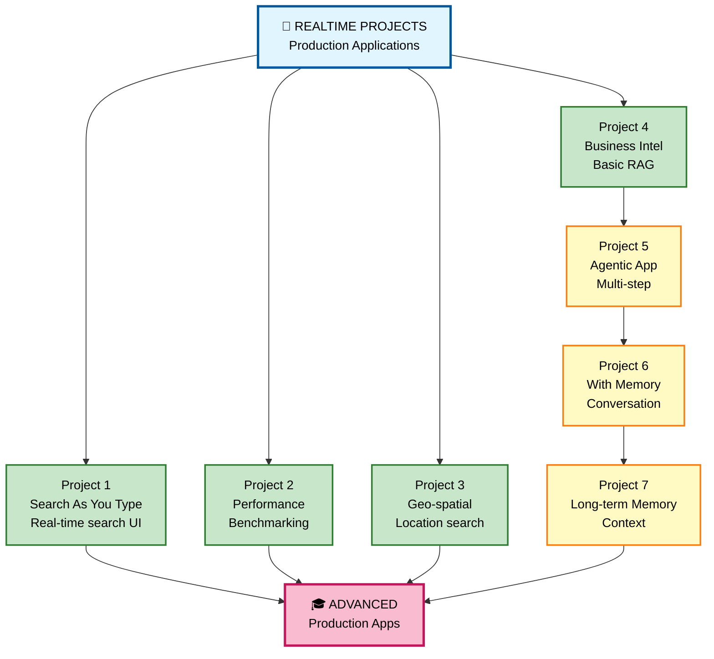
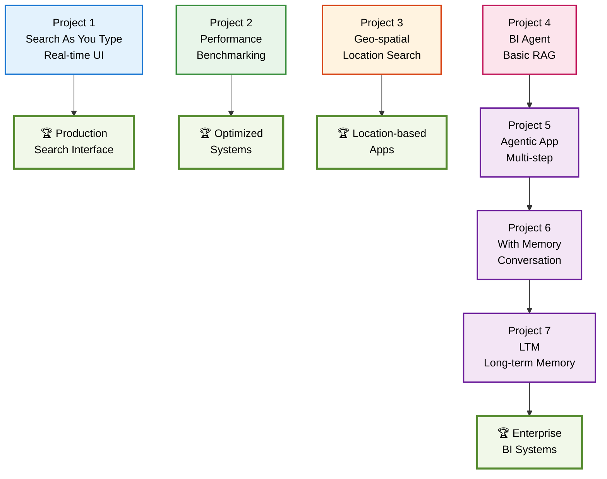
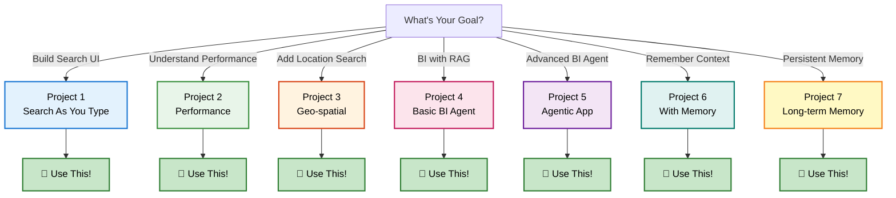
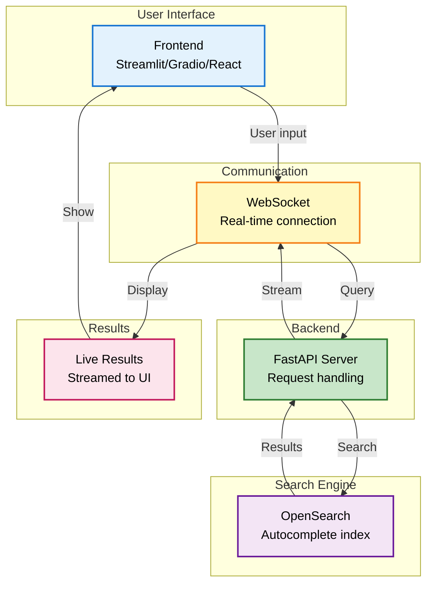
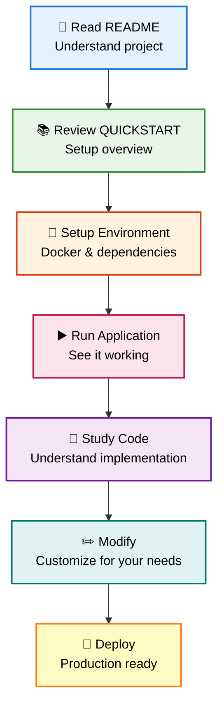

# 📖 Realtime Projects - Complete Learning Guide

## 🎯 Quick Navigation

### For Students - Where to Start?

**I want to build real applications** → Start here:
1. Choose a project that interests you
2. Review its README and QUICKSTART
3. Follow the setup instructions

**I want search-as-you-type** → Go to:
- Folder 1: Search As You Type - Full frontend implementation

**I want business intelligence** → Go to:
- Folder 4-7: Business Intelligence Agent/Apps with RAG, memory, and long-term memory

**I want to understand performance** → Go to:
- Folder 2: Ingestion and Search Performance - Benchmarking

**I want geographic search** → Go to:
- Folder 3: Geo-spatial - Location-based queries

---

## 🏗️ Project Overview



---

## 📁 Project Structure

### 1. search_as_you_type/
**Status**: Full-featured, production-ready application

**Purpose:** Real-time search interface with live autocomplete and instant results

**Key Features:**
- Real-time search suggestions
- Instant result updates
- Multiple frontend options (Streamlit, Gradio, React)
- Backend API
- WebSocket support
- Full architecture documentation

**Technology Stack:**
- **Backend**: Python FastAPI
- **Frontends**: 
  - Streamlit (quick development)
  - Gradio (simple interface)
  - React (advanced UI)
- **Search**: OpenSearch with autocomplete
- **Communication**: WebSocket for real-time updates

**Key Files:**
- `README.md` - Project overview
- `QUICKSTART.md` - Fast setup guide
- `ARCHITECTURE.md` - System design
- `FRONTEND_COMPARISON.md` - Frontend options analysis
- `REALTIME_SEARCH.md` - Implementation details
- `NETWORK_CONFIG.md` - Networking setup
- `PROJECT_SUMMARY.md` - Complete summary
- `backend/` - Python backend code
- `streamlit_app.py` - Streamlit frontend
- `gradio_app.py` - Gradio frontend
- `react-frontend/` - React application

**What You'll Learn:**
- Real-time data streaming
- WebSocket communication
- Frontend backend integration
- Search optimization for UX
- Production deployment

---

### 2. ingestion_and_search_performance/
**Status**: Demonstration and benchmarking

**Purpose:** Compare performance metrics of different ingestion and search strategies

**Key Features:**
- Performance comparisons
- Benchmark data
- Optimization insights
- Real metrics from production

**Key Files:**
- `ingestion_search_performance_comparisons.ipynb` - Interactive notebook
- `docker-compose-opensearch-single.yml` - Test environment

**What You'll Learn:**
- Performance measurement
- Optimization techniques
- Bottleneck identification
- Scaling strategies

---

### 3. geo_spatial/
**Status**: Geo-spatial search implementation

**Purpose:** Location-based search and geographic queries

**Key Features:**
- Geographic data indexing
- Distance queries
- Bounding box searches
- Location-based filtering

**Technology:**
- Geo-point mappings
- Distance aggregations
- Spatial queries

**Key Files:**
- `geo_spatial_data.ipynb` - Interactive examples
- `app/` - Application code

**What You'll Learn:**
- Geo-spatial indexing
- Distance calculations
- Location-based features
- Map integration patterns

---

### 4. business_intelligence_agent/
**Status**: Basic RAG with database integration

**Purpose:** Query business databases using natural language with RAG

**Key Features:**
- SQL database integration (PostgreSQL, MSSQL)
- Natural language to SQL
- RAG over database schemas
- Basic agent reasoning
- Knowledge base of database structure

**Technology Stack:**
- **Database**: PostgreSQL or MSSQL
- **Search**: OpenSearch
- **LLM**: Configurable (OpenAI, etc.)
- **Framework**: Python agent

**Key Files:**
- `README.md` - Project overview
- `QUICKSTART.md` - Setup guide
- `WHAT_IS_RAG.md` - RAG explanation
- `PROJECT_SUMMARY.md` - Complete summary
- `pyproject.toml` - Python dependencies
- `docker-compose-*.yml` - Multiple configurations
- `opensearch-POSTGRES-RAG/` - PostgreSQL implementation
- `opensearch-MSSQL-RAG/` - MSSQL implementation
- `non-RAG/` - Baseline comparison

**What You'll Learn:**
- LLM integration with databases
- RAG systems in practice
- Multi-step reasoning
- Agent design patterns
- Database schema understanding

---

### 5. business_intelligence_agentic_app/
**Status**: Advanced agent with multi-turn dialogue

**Purpose:** Enhanced BI agent with agentic capabilities and workflows

**Key Features:**
- Multi-step reasoning
- Tool calling
- Stateless agents
- Database integration
- Streamlined workflows

**Technology Stack:**
- Similar to Project 4
- Enhanced agent framework
- Better tool definition

**Key Files:**
- `README.md` - Overview
- `QUICKSTART.md` - Setup
- `INDEX.md` - Documentation index
- `PROJECT_SUMMARY.md` - Full summary
- `WORKFLOW.md` - Workflow documentation
- `app.py` - Main application
- `pyproject.toml` - Dependencies

**What You'll Learn:**
- Advanced agent frameworks
- Tool definition and use
- Multi-step workflows
- Error recovery

---

### 6. business_intelligence_agentic_app_memory/
**Status**: Agent with conversational memory

**Purpose:** BI agent that remembers conversation history for context

**Key Features:**
- Conversational memory
- Multi-turn context
- Query history
- Contextual reasoning
- Better user experience

**Technology Stack:**
- Based on Project 5
- Added memory layer
- Session management

**Key Files:**
- `README.md` - Overview
- `QUICKSTART.md` - Setup
- `CONVERSATIONAL_MEMORY_IMPLEMENTATION.md` - Memory details
- `POSTGRESQL_CASE_SENSITIVITY_FIX.md` - Database fixes
- `INDEX.md` - Documentation
- `PROJECT_SUMMARY.md` - Summary
- `WORKFLOW.md` - Workflows
- `app.py` - Application with memory

**What You'll Learn:**
- Memory management in agents
- Conversation context
- State preservation
- Multi-turn interactions

---

### 7. business_intelligence_agentic_app_ltm/
**Status**: Agent with long-term memory

**Purpose:** Advanced agent with persistent long-term memory across sessions

**Key Features:**
- Long-term memory storage
- Persistent context
- Session continuity
- Knowledge accumulation
- Advanced reasoning

**Technology Stack:**
- Based on Project 6
- Enhanced memory system
- Persistent storage layer

**Key Files:**
- `README.md` - Overview
- `LTM_IMPLEMENTATION.md` - LTM details
- `CHECKBOX_UI_UPDATE.md` - UI improvements
- `app.py` - Application with LTM
- Configuration files

**What You'll Learn:**
- Long-term memory patterns
- Persistent state management
- Knowledge graphs
- Advanced agent patterns

---

## 🎓 Project Progression



---

## 💡 Which Project For Your Goals?



---

## 🏛️ Search-as-You-Type Architecture



---

## 🏛️ BI Agent with Memory Architecture

```mermaid
graph TB
    subgraph "User"
        USER["👤 User<br/>Questions"]
    end
    
    subgraph "Interface"
        UI["Streamlit App<br/>Conversation UI"]
    end
    
    subgraph "Agent Layer"
        MEMORY["Memory<br/>Conversation history"]
        AGENT["Agent<br/>Reasoning engine"]
    end
    
    subgraph "Tools"
        SCHEMA["Schema Tool<br/>Database structure"]
        NL2SQL["NL-to-SQL Tool<br/>Query generation"]
    end
    
    subgraph "Data"
        DB["Database<br/>PostgreSQL/MSSQL"]
        OS["OpenSearch<br/>Schema knowledge"]
    end
    
    subgraph "LLM"
        LLM["LLM<br/>GPT-4/Claude"]
    end
    
    USER -->|Ask| UI
    UI -->|Question + History| MEMORY
    MEMORY -->|Context| AGENT
    AGENT -->|Need schema?| SCHEMA
    AGENT -->|Need query?| NL2SQL
    SCHEMA -->|Get| OS
    NL2SQL -->|Generate| DB
    DB -->|Results| AGENT
    AGENT -->|Reason| LLM
    LLM -->|Response| AGENT
    AGENT -->|Answer| UI
    UI -->|Display| USER
    
    classDef user fill:#fff9c4,stroke:#f57f17,stroke-width:2px,color:#000
    classDef ui fill:#e3f2fd,stroke:#1976d2,stroke-width:2px,color:#000
    classDef agent fill:#c8e6c9,stroke:#2e7d32,stroke-width:2px,color:#000
    classDef tools fill:#fce4ec,stroke:#c2185b,stroke-width:2px,color:#000
    classDef data fill:#f3e5f5,stroke:#6a1b9a,stroke-width:2px,color:#000
    classDef llm fill:#e0f2f1,stroke:#00796b,stroke-width:2px,color:#000
    
    class USER user
    class UI ui
    class MEMORY,AGENT agent
    class SCHEMA,NL2SQL tools
    class DB,OS data
    class LLM llm
```

---

## 📚 What Each Project Teaches

### Project 1: Search As You Type
- Real-time web interfaces
- WebSocket communication
- Frontend-backend integration
- User experience optimization

### Project 2: Performance Benchmarking
- Performance measurement techniques
- Optimization identification
- Scaling strategies
- Data collection and analysis

### Project 3: Geo-spatial
- Geographic data structures
- Distance calculations
- Location-based queries
- Map integration

### Project 4-7: BI Agents (Progression)
- **4**: Basic RAG + database integration
- **5**: Multi-step reasoning and tools
- **6**: Conversational context management
- **7**: Long-term knowledge persistence

---

## 🚀 Quick Start Paths

### Path 1: Search Interface Developer
```
1. Start: Project 1 (Search As You Type)
2. Explore: QUICKSTART.md
3. Try: Each frontend option
4. Optimize: Using Project 2 insights
```

### Path 2: BI Application Developer
```
1. Start: Project 4 (Basic BI Agent)
2. Study: WHAT_IS_RAG.md
3. Progress: Project 5, 6, 7
4. Build: Full conversational app
```

### Path 3: Performance Engineer
```
1. Start: Project 2 (Performance)
2. Benchmark: Different strategies
3. Optimize: Project 1 or Project 4
4. Measure: Improvements
```

### Path 4: Location-Based Services
```
1. Start: Project 3 (Geo-spatial)
2. Learn: Geographic queries
3. Integrate: With Project 1
4. Deploy: Location search UI
```

---

## ✨ Tips for Success

1. **Read First**: Review README and QUICKSTART before coding
2. **Follow Docs**: Each project has architecture and workflow docs
3. **Try Examples**: Run the provided code first
4. **Understand Design**: Study the architectural decisions
5. **Customize**: Adapt projects for your use cases
6. **Test Thoroughly**: Use project's test patterns
7. **Deploy Properly**: Follow deployment documentation
8. **Have Fun**: These are powerful, real-world systems!

---

## 🎯 Success Path (Any Project)



---

## ❓ FAQ

**Q: Which project should I start with?**
A: Choose based on your interest - UI (Project 1), BI (Project 4-7), Performance (Project 2), or Location (Project 3)

**Q: Do I need a database for BI projects?**
A: Yes, projects 4-7 use PostgreSQL or MSSQL. Scripts provided for setup.

**Q: Can I run multiple projects?**
A: Yes, but watch resource usage. Each needs OpenSearch and potentially a database.

**Q: What's the difference between Projects 4, 5, 6, 7?**
A: Progressively add multi-step reasoning, memory, and long-term context persistence.

**Q: How do I customize these projects?**
A: Each is designed to be modified. Study the code structure and adapt for your data.

**Q: Are these production-ready?**
A: Yes, though you may want to add authentication, error handling, and monitoring for your deployment.

**Q: Where's the documentation?**
A: Each project folder has README.md, QUICKSTART.md, and detailed documentation files.

---

## 📁 File Organization

```
5. REALTIME_PROJECTS/
├── 1. search_as_you_type/          # Real-time search UI
│   ├── backend/
│   ├── streamlit_app.py
│   ├── gradio_app.py
│   ├── react-frontend/
│   ├── README.md
│   └── QUICKSTART.md
├── 2. ingestion_and_search_performance/
│   └── ingestion_search_performance_comparisons.ipynb
├── 3. geo_spatial/
│   ├── geo_spatial_data.ipynb
│   └── app/
├── 4. business_intelligence_agent/
│   ├── opensearch-POSTGRES-RAG/
│   ├── opensearch-MSSQL-RAG/
│   ├── README.md
│   ├── WHAT_IS_RAG.md
│   └── QUICKSTART.md
├── 5. business_intelligence_agentic_app/
│   ├── app.py
│   ├── README.md
│   └── QUICKSTART.md
├── 6. business_intelligence_agentic_app_memory/
│   ├── app.py
│   ├── CONVERSATIONAL_MEMORY_IMPLEMENTATION.md
│   └── QUICKSTART.md
└── 7. business_intelligence_agentic_app_ltm/
    ├── app.py
    ├── LTM_IMPLEMENTATION.md
    └── README.md
```

---

## 🎓 Core Competencies

After exploring these projects, you'll understand:

1. **Real-time Interfaces**: WebSocket and streaming applications
2. **Search Optimization**: UX-focused search implementation
3. **Performance Tuning**: Measuring and optimizing systems
4. **Geographic Search**: Location-based queries
5. **RAG Systems**: Retrieval-augmented generation in practice
6. **Agent Design**: Multi-step reasoning agents
7. **Memory Management**: Conversational context and persistence
8. **Database Integration**: LLM and database interaction
9. **Full-stack Development**: From UI to backend to data
10. **Production Patterns**: Real-world deployment considerations

---

## 🌟 Key Features Across Projects

- **Project 1**: Real-time, WebSocket, multi-frontend
- **Project 2**: Benchmarking, comparison, optimization insights
- **Project 3**: Geographic indexing, distance queries, location features
- **Projects 4-7**: Progressive complexity, RAG, agents, memory, persistence

---

## ✨ Your Learning Journey

These are **production-ready applications** showing real-world OpenSearch usage patterns.

Choose a project matching your interests and dive in!

**Start building, learning, and creating value! 🚀**

---

**Repository**: elasticsearch_opensearch  
**Branch**: os-3.2.0  
**Status**: ✅ Ready for learning and production deployment
