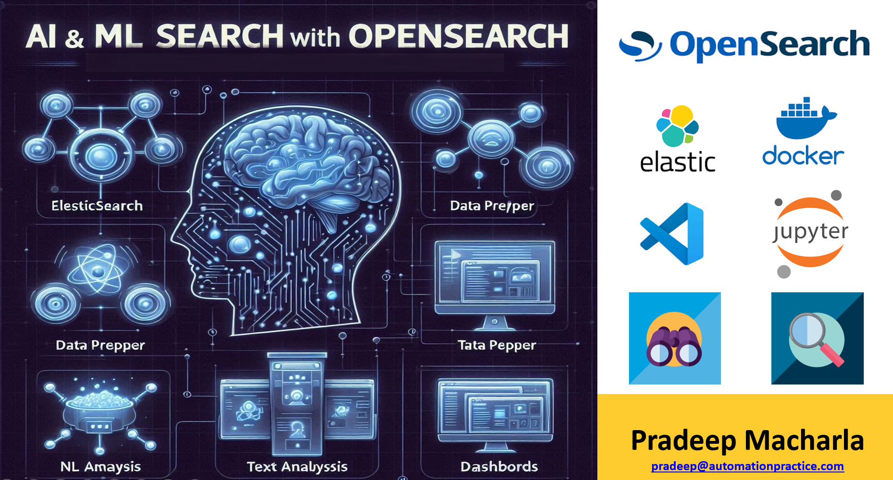
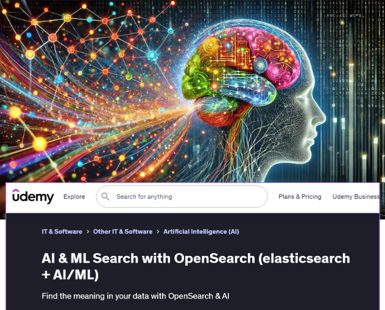
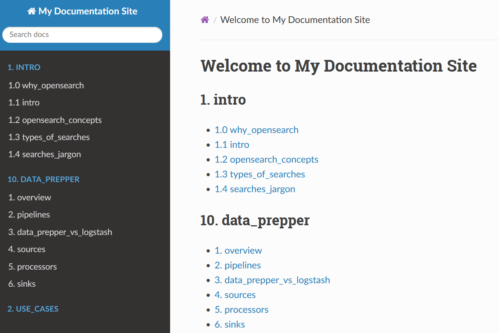
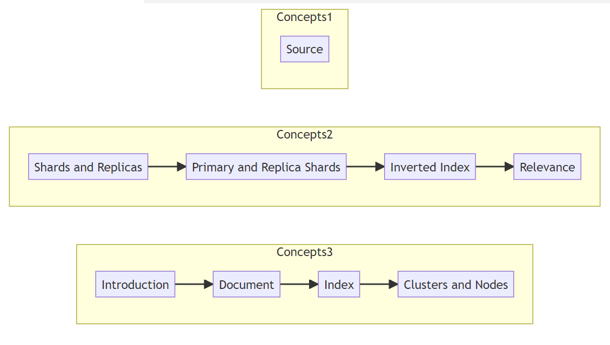
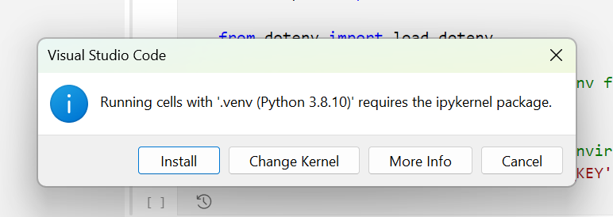

# OPENSEARCH COURSE
  
This repo contains tutorials, code, documentation that drives my opensearch course content. Throughout the course: `OS=opensearch` & `ES=elasticsearch`

# UDEMY
The udemy course is published here:

# COURSE MODULES
| 🛠️ **OpenSearch - Getting Started**                              | 💻 **Installation and System Requirements**                       | 🔍 **OpenSearch Concepts**                                       | 📖 **OpenSearch - Text Analysis**                           | 🔗 **OpenSearch - Traditional and AI/ML Search**                           | 🤖 **Machine Learning**                                                      | 🧩 **Agents and Tools**                                                      | 📊 **OpenSearch Dashboards \| Observability**                                    | 🗂️ **Data Prepper Intro**                                      | 🌐 **Real-Time Projects**                           |
|:----------------------------------------------------------------|:-----------------------------------------------------------------|:----------------------------------------------------------------|:-----------------------------------------------------------|:-----------------------------------------------------------------------------|:-----------------------------------------------------------------------------|:-----------------------------------------------------------------------------|:--------------------------------------------------------------------------------|:---------------------------------------------------------------|:------------------------------------------------------|
| 👋 Who are we \| Housekeeping \| Machine resources needed       | 🛠️ System & Network Requirements \| Configuration                 | 🧠 What is Search - Analogy                                     | 🛠️ Demo: ElasticSearch minimal                          | 🔍 Search Methods \| Query Languages \| Performance \| Relevance          | 🧬 ML Commons Plugin \| Algorithms \| Using LLM Models           | ⚙️ Overview \| Types of Agents \| Demo Flow Agent (RAG)          | 🌟 Getting Started \| Query Languages \| Components              | 📋 Data Prepper \| Use Cases \| Concepts                          | 🚀 Project1: Load, create, and restore within OpenSearch |
| 🗃️ PreRequisites \| Why Elasticsearch \| Motivation             | 🔌 Plugins \| Upgrading                                           | 🔗 What is OpenSearch \| History \| Capabilities               | 🛠️ Demo: ES & OS minimal (continued)                     | 🔎 Search Results \| Highlight \| Paginate \| Sort \| AutoComplete        | 🤖 Demo: Pretrained sentence transformer model                  | ⚙️ Demo: RAG with non-supported transformers                   | 📊 Dashboards End-to-End walkthrough                               | 🛠️ Data Prepper \| vs. Logstash \| Sources \| Processors         | 🚀 Project2: Migrate from ElasticSearch to OpenSearch    |
| 🗂️ Demo: Folders \| Course Overview                             | ⚙️ OS client libraries                                            | 🔍 Types of Searches                                           | 🛠️ Text Analysis Pipeline                                 | 🔍 Retrieve Fields \| Keyword Search                              | 🤖 Demo: Pretrained ONNX Sentence Transformer                   | ⚙️ Demo: RAG with interns dataset                              | 📈 Demo: Analyzing Data                                           | 🛠️ Demo: Log ingestion Apache Logs                                | 🚀 Project3: Geo Spatial Analysis                        |
| 📂 Demo: Datasets \| Downloads                                  | 🛠️ AWS EC2 Setup: Install and Access                              | 🏭 Use Cases By Industry                                       | 🛠️ Analyzers \| Components \| Use Cases                   | 🔎 Demo: Search Data                                             | 🤖 Demo: Local Torch Transformers                              | ⚙️ Tools \| Rerank                                             | 🎨 Custom Branding                                                | 📊 Demo: Log Ingestion Open Telemetry Logs                        |                                                       |
|                                                                 | 🛠️ EC2 Setup Continued                                            | ⚖️ Competitive Analysis: OpenSearch vs. Elasticsearch          | 🔠 Tokenizers \| Filters                                   | 🔍 kNN Search \| kNN Index                                   | 🤖 Demo: Sparse Encoding Transformers                          | ⚙️ Conversational Flow Agent                                   | 📊 Observability \| Integrations \| Notebooks                    |                                                                |                                                       |
|                                                                 | 🛠️ Local Machine Setup                                            | 🔗 OS Architecture: Shards \| Inverted Index                   | 🛠️ Demo: Mappings                                         | 🔍 Neural Search                                             | 🤖 Demo: Cross Encoder Transformers                            | ⚙️ Knowledge Base Agents                                      | 📊 Reporting \| Search Relevance                                   |                                                                |                                                       |
|                                                                 |                                                                  |                                                               | 🔠 Normalization \| Techniques \| Filters                 | 🤖 Intuition \| LLM Analogies                               | 🤖 External Model: OpenAI Integration                          | ⚙️ RAG: Dynamic Index Selection                               |                                                                 |                                                                |                                                       |
|                                                                 |                                                                  |                                                               |                                                           | 🧠 Sentence Transformers                                   | 🔌 Connector Blueprints \| Processing                         | ⚙️ Chatbot Agents                                             |                                                                 |                                                                |                                                       |
|                                                                 |                                                                  |                                                               |                                                           | 📦 Vector Indexing                                          |                                                               |                                                               |                                                                 |                                                                |                                                       |
|                                                                 |                                                                  |                                                               |                                                           | 🔍 kNN Search Continued                                    |                                                               |                                                               |                                                                 |                                                                |                                                       |

# PREREQUISITES FOR THE COURSE
- **Human taking the course**: 
  - Eagerness and excitement to learn and understand how `search` worked traditionally vs. `AI/Ml-driven search` from ground up
  - Basics of being able to `navigate in a linux environment` (e.g. ls, rm, cd)
  - Basics of `docker` / container technology (including docker compose)
  - `Basic python` coding
  - Basics of server/client tech
- **Machine Resources**: See below

# WHY ELASTICSEARCH REFERENCES
- The repo name contains `elasticsearch` because opensearch started as a fork of elasticsearch (> 7.x version) platform 
- As of today (November 2024), elasticsearch is one of the most used enterprise search platform in its segment - though my guess OS will take significant market share , especially as AI/ML gains more prominence
- If you have ES experience / background, very high probability that you will be considered a top candidate for OS jobs and projects that involve `migration from elasticsearch to opensearch`

# MOTIVATION FOR THE COURSE
- There are many ES courses online and it is a pretty mature platform in startups, mid-level or enterprise contexts. 
- Just search for `List top 25 enterprise companies using elasticsearch` on google/perplexity (also search for `top 25 using OpenSearch`). In the search results, note that `Oracle` switched from ES > OS for their PeopleSoft's search capabilities
- The clouds have already changed the software licensing incentives and model structures in the world. So why `continue paying for software licenses especially when you have an equivalent` or better open source equivalent (you anyways cannot get away paying for support, skills and large scale needs like data center infra, AI models)
- You already give away the most precious asset (data) to the search platform, so why still pay additional for authN/authZ , UI and other commoditized software pieces - Reduce it !
- `Opensearch` is relatively new and you can almost count the number of courses available out there. Since I have used both (ES and OS)
  - I believe there is a good market space for OS to positively disrupt, 
  - 80% of your initial dev journey (until you prove a concept) doesn't need to have the trial license sword hanging on you
- Many more (follow the course) 

# ORGANIZATION OF THE COURSE
- Two high level folders: [opensearch](./opensearch/) & [elasticsearch_for_relative_context](./elasticsearch_for_relative_context/)
- **Elasticsearch**: [elasticsearch_for_relative_context](./elasticsearch_for_relative_context/) folder contains content related to elasticsearch. I provide this to draw parallels between ES and OS and how similar they are.
- **Tutorial**: In each of the main folder, there is subfolder [my_tutorial](./opensearch/my_tutorial/), that contains the majority of what I instruct. 
- **Code**: All code is inside [scripts](./opensearch/my_tutorial/scripts/) subfolder and [notebook](./opensearch/my_tutorial/notebooks/) subfolder. Contains python, shell, docker compose files etc.
- **Data**: subfolder [data](./opensearch/my_tutorial/data/) contains all datasets used for this course. The main sources are `ecommerce` dataset (provided by opensearch team), `interns_sample` dataset (real jobs dataset that I provide), `uscities` dataset for geospatial analysis etc. All data is provided as separate links
- **Documentation**: 
All documentation in various forms can be `auto-generated` from this git repo (except the powerpoint presentations, because I had to manually create those for the course)  

  - Presentations / pdfs that I provide as part of the course (not included in this git repo)
  - [docs](./opensearch/my_tutorial/docs/) subfolder with markdown files that has very detailed content and can be used as reference or search when applying concepts in real world (most of it comes from the horses mouth aka. opensearch documentation, but I vetted every word, sentence, token etc. :) ). The   - [docs](./opensearch/my_tutorial/docs/) subfolder with markdown files that has very detailed content and can be used as reference or search when applying concepts in real world (most of it comes from the horses mouth aka. opensearch documentation, but I vetted every word, sentence, token etc. :) ). The `docs` folder can also be served as a static content website locally if you prefer that way (instructions [here](./opensearch/my_tutorial/README.md)) 
 folder can also be served as a static content website locally if you prefer that way (instructions [here](./opensearch/my_tutorial/README.md)) 
  - `docs_pdf_weasyprint` - contains the pdf version of all the markdown files (you can auto-generate all the pdfs using the script [here](./opensearch/my_tutorial/generate_md_to_pdf_weasyprint.py)) 
  - `mermaid diagrams`: Mermaid diagrams can draw diagrams using code. It is very helpful, when you want to visually talk, express or share concepts BEFORE getting into the nitty-grittys. My script [here](./opensearch/my_tutorial/generate_mermaid_diagrams.py) reads the markdown files, and converts headings into flow diagrams. Feel free to run and generate your own or modify the auto-generate script for e.g. maybe you prefer diagram flow to be LR (left-to-right flow) instead of TD (top-down flow) 
  - `mermaid images`: Mermaid diagrams get rendered with specific mermaid plugin/module/extension etc. But sometimes you might just want an image in png/svg/jpeg, so you are not dependent on any services/software. The script [here](./opensearch/my_tutorial/generate_mermaid_images.py) will generate all images.

# HARDWARE, TOOLS & SOFTWARE
- **HARDWARE**: Bare metal or virtual OS as long as you have at least 8GB RAM, 4 CPUs and 50GB storage (I executed on 16gb ram, 4 cpu)
- **MAIN** OPENSEARCH (of course) 2.17 & 2.16 & ELASTICSEARCH (trial version 8.15.0)
- **SERVER OPERATING SYSTEM**: Linux (ubuntu 20.04 or 22.04). This is where we launch opensearch server and execute scripts
- **CLIENT OPERATING SYSTEM**: This is where we launch the IDE and our primary interface for the course. This can be `windows` or `linux` or `mac`
- **DOCKER**: Docker version 27.2.0, build 3ab4256
- **PROGRAMMING LANGUAGES**: Python 3.8.10 (or greater) and modules, shell, SQL/DQL (comes with opensearch)
- **IDE**: VS CODE 1.95.3 (primarily) and extensions, Jupyter

# STUDENT ENVIRONMENT
There are many ways to align infrastructure to do this course, however the below diagram is what we will be conforming to:  

# WHY NOT WINDOWS SERVER
Entire course execution is mostly inside docker, so as long as you have docker runtime it doesn't matter - windows can also work totally. I have executed about 50% of scripts on windows, but you are welcome to reach out by emailing me directly [here](pradeep@automationpractice.com) if you run into real issues.  

> **Btw** - your client operating system can be any of [windows, max, *nix]

# VS CODE EXTENSIONS
- All the vscode extensions I used are in the [file](./vscode-extensions.txt)
- You can import all those extensions into your environment 
  - `cat vscode-extensions.txt | xargs -n 1 code --install-extension`  - *nix bash
  - `Get-Content vscode-extensions.txt | ForEach-Object { code --install-extension $_ }` - windows powershell
  - `for /F "delims=" %i in (vscode-extensions.txt) do code --install-extension %i` - windows command prompt
  - **Or search for the extensions one-by-one and install** 

# GOTCHAS
- On aws ec2 ubuntu instance, if you get error on `permission denied for /var/run/docker.sock`, then execute `sudo chmod 666 /var/run/docker.sock`
- When running a notebook first time, vscode might ask to install ipykernel package: Go ahead and install 