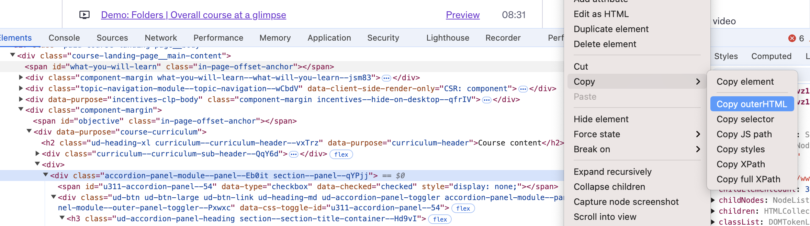

## Steps
- tabulate library is used
- From course public website, copy the outerHTML from chrome inspector  into the file course.html
- Run `python3 extract.py` - This produces the file course.md
- Format the course.md file using any LLM (this is the markdown table)
- copy it over to main README.md 