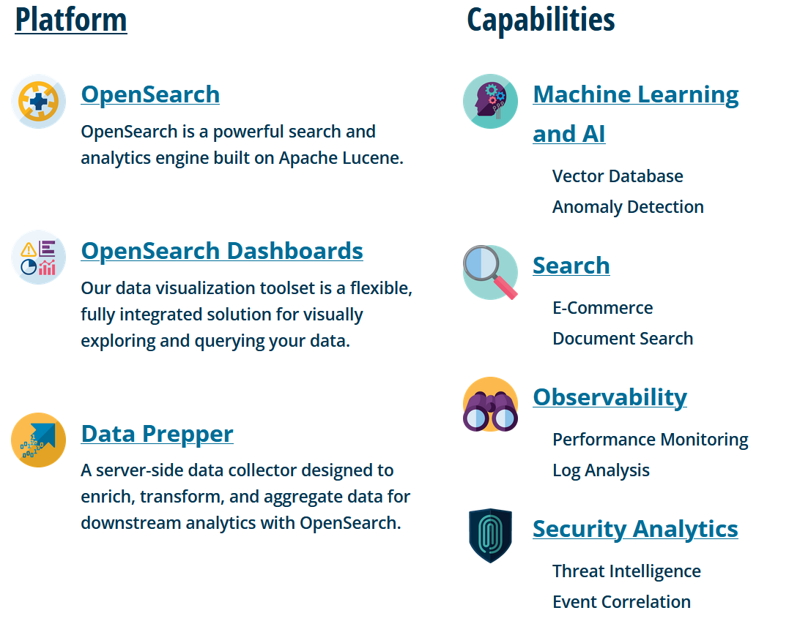

# What is Opensearch
- [OpenSearch](https://opensearch.org/) is an open-source, enterprise-grade search and observability suite that brings order to unstructured data at scale aka. find meaning in your data
- OpenSearch is a community-driven, Apache 2.0-licensed open source search and analytics suite that makes it easy to ingest, search, visualize, and analyze data
- Opensearch is a [linux-foundation project](https://www.linuxfoundation.org/press/linux-foundation-announces-opensearch-software-foundation-to-foster-open-collaboration-in-search-and-analytics) as of September 2024
- Opensearch is open-source fork of Elasticsearch and Kibana (~v7.10/v7.11 fork) around April 2021

# Features

