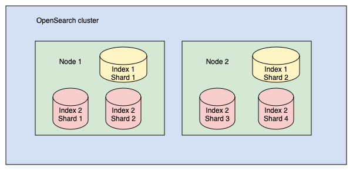
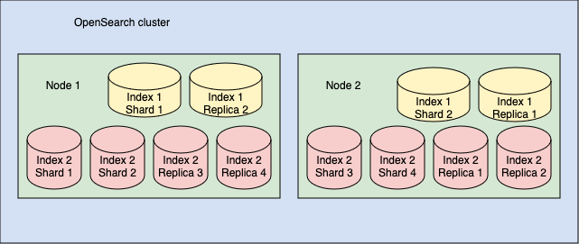

# Introduction
- OpenSearch is a distributed, RESTful search and analytics engine capable of solving a growing number of use cases.
- The term distributed means that you can run OpenSearch on multiple computers. 
- Search and analytics means that you can search and analyze your data once you ingest it into OpenSearch

# Document
- A document is a unit that stores information (text or structured data) including vectors, tensors, and images.

# Index
- An index is a collection of documents.

# Clusters and Nodes
- An OpenSearch cluster is a collection of nodes.
- In each cluster, there is an elected cluster manager node, which orchestrates cluster-level operations, such as creating an index. Nodes communicate with each other, so if your request is routed to a node, that node sends requests to other nodes, gathers the nodes’ responses, and returns the final response.

# Shards and Replicas
- OpenSearch splits indexes into shards. Each shard stores a subset of all documents in an index
- Shards are used for even distribution across nodes in a cluster
- each shard is actually a full Lucene index
- each instance of Lucene is a running process that consumes CPU and memory. 
- More shards is not necessarily better

# Primary and Replica Shards
- a shard may be either a primary (original) shard or a replica (copy) shard
- By default, OpenSearch creates a replica shard for each primary shard

# Inverted Index
- An inverted index maps words to the documents in which they occur. For example, consider an index containing the following two documents:

Document 1: “Beauty is in the eye of the beholder”  
Document 2: “Beauty and the beast”

| Word     | Document |
|----------|----------|
| beauty   | 1, 2     |
| is       | 1        |
| in       | 1        |
| the      | 1, 2     |
| eye      | 1        |
| of       | 1        |
| beholder | 1        |
| and      | 2        |
| beast    | 2        |  

- In addition to the document ID, OpenSearch stores the position of the word within the document for running phrase queries, where words must appear next to each other.

# Relevance
- Each document is assigned a relevance score that tells you how well the document matched the query
- A search term that occurs more frequently in a document will tend to be scored higher. A document about dogs that uses the word dog many times is likely more relevant than a document that contains the word dog fewer times. This is the term frequency component of the score.
- A search term that occurs in more documents will tend to be scored lower. A query for the terms blue and axolotl should prefer documents that contain axolotl over the likely more common word blue. This is the inverse document frequency component of the score.
- A match on a longer document should tend to be scored lower than a match on a shorter document. A document that contains a full dictionary would match on any word but is not very relevant to any particular word. This corresponds to the length normalization component of the score
- OpenSearch uses the [BM25](https://en.wikipedia.org/wiki/Okapi_BM25) ranking algorithm to calculate document relevance scores and then returns the results sorted by relevance

# Source
- https://opensearch.org/docs/latest/getting-started/intro/