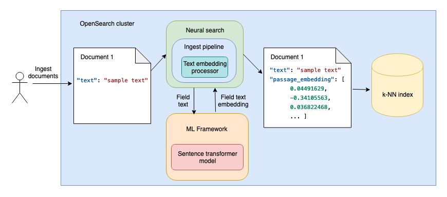

# Neural Search
Neural search encapsulates the infrastructure needed to perform semantic vector searches. After you integrate an inference (embedding) service, neural search functions like lexical search, accepting a textual query and returning relevant documents.

When you index your data, neural search transforms text into vector embeddings and indexes both the text and its vector embeddings in a vector index. When you use a neural query during search, neural search converts the query text into vector embeddings and uses vector search to return the results.

## Search methods
Choose one of the following search methods to use your model for neural search:

- **Semantic search**: Uses dense retrieval based on text embedding models to search text data.
- **Hybrid search**: Combines lexical and neural search to improve search relevance.
- **Multimodal search**: Uses neural search with multimodal embedding models to search text and image data.
- **Neural sparse search**: Uses neural search with sparse retrieval based on sparse embedding models to search text data.
- **Conversational search**: With conversational search, you can ask questions in natural language, receive a text response, and ask additional clarifying questions.

## Terminology

- **Neural search**: Facilitates vector search at ingestion time and at search time:
  - At ingestion time, neural search uses language models to generate vector embeddings from the text fields in the document. The documents containing both the original text field and the vector embedding of the field are then indexed in a k-NN index, as shown in the following diagram.

  - At search time, when you then use a neural query, the query text is passed through a language model, and the resulting vector embeddings are compared with the document text vector embeddings to find the most relevant results, as shown in the following diagram

- **Semantic search**: Employs neural search in order to determine the intention of the user’s query in the search context, thereby improving search relevance.

- **Hybrid search**: Combines semantic and keyword search to improve search relevance

## Engine recommendations
- In general, select NMSLIB or Faiss for large-scale use cases. 
- Lucene is a good option for smaller deployments and offers benefits like smart filtering, where the optimal filtering strategy—pre-filtering, post-filtering, or exact k-NN—is automatically applied depending on the situation.
  |                  | NMSLIB/HNSW       | Faiss/HNSW       | Faiss/IVF        | Lucene/HNSW       |
  |------------------|-------------------|------------------|------------------|-------------------|
  | **Max dimensions** | 16,000            | 16,000           | 16,000           | 16,000            |
  | **Filter**         | Post-filter       | Post-filter      | Post-filter      | Filter during search |
  | **Training required** | No               | No               | Yes              | No                |
  | **Similarity metrics** | l2, innerproduct, cosinesimil, l1, linf | l2, innerproduct | l2, innerproduct | l2, cosinesimil    |
  | **Number of vectors** | Tens of billions | Tens of billions | Tens of billions | Less than 10 million |
  | **Indexing latency** | Low              | Low              | Lowest           | Low               |
  | **Query latency and quality** | Low latency and high quality | Low latency and high quality | Low latency and low quality | High latency and high quality |
  | **Vector compression** | Flat             | Flat             |                  |                   |
  | **Product quantization** | Flat             |                  | Flat             |                   |
  | **Memory consumption** | High             | High             | Low with PQ      | Medium            | High              | Low with PQ |
