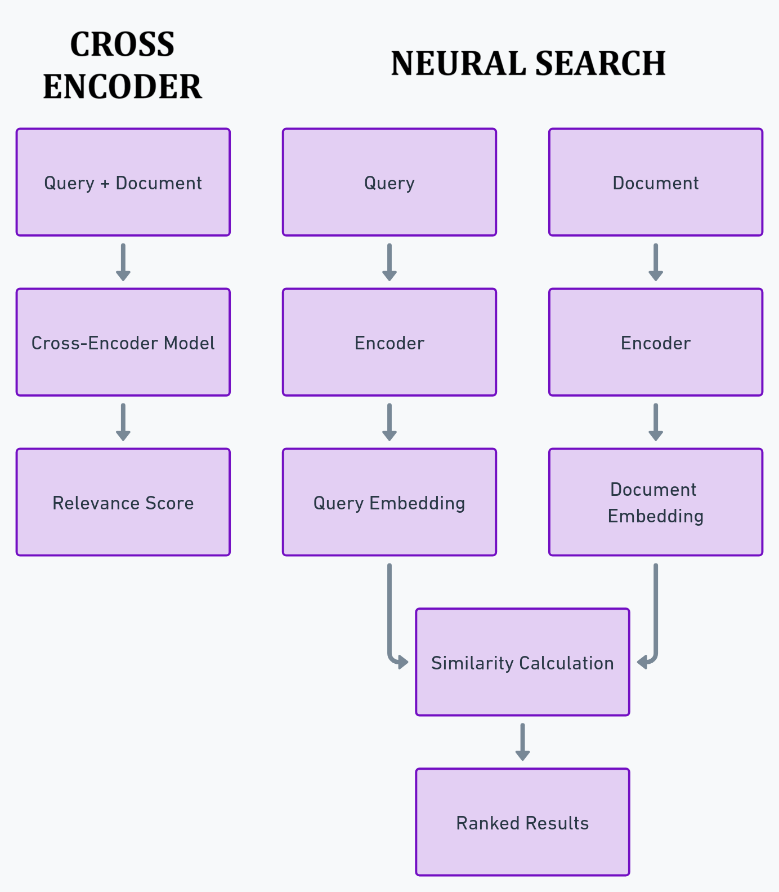

# Cross-encoders vs. Neural
A benchmarking excercise done by opensearch team is [here](https://opensearch.org/blog/semantic-science-benchmarks/). 
- `TL;DR:` There are benefits of combining keyword-based search with neural search
- `Premise:` A search engine should work well for both keyword and natural language searches

# Side by side
There are two ways of incorporating transformers in search: as `cross-encoders` and `neural retrievers`.

| Feature          | Cross-Encoders                                      | Neural Retrievers                                      |
|------------------|-----------------------------------------------------|--------------------------------------------------------|
| Input Processing | Process query and document pair simultaneously      | Process query and document independently               |
| Output           | Relevance score for the input pair                  | Vector representations (embeddings) for query and document |
| Effectiveness    | Generally more effective for ranking                | Efficient for large-scale retrieval                    |
| Efficiency       | Computationally expensive for large document sets   | More efficient for searching large collections         |
| Use Case         | Reranking a small set of documents                  | Initial retrieval from large document collections      |
| Scalability      | Limited scalability due to pairwise comparisons     | Highly scalable using approximate nearest neighbor search |

# Conclusions

>**neural retrievers combined with BM25 yield better results than cross-encoders, as shown by our experiments.**

### Details

> - Neural retrievers with BM25 work better than neural retrievers or BM25 alone.
>  - Neural retrievers with BM25 deliver the same (or better) results as cross-encoders at a fraction of the cost and latency.
>  - If a dataset contains a lot of keyword usage, BM25 works much better than neural retrievers. An example of such a dataset is one containing factory part numbers.
>  - If a dataset contains a lot of natural language, neural retrievers work much better than BM25. An example is data from a community forum.
>  - For datasets that contain both natural language and keywords, a combination of BM25 and neural retrievers works better. An example of such a dataset is one containing data for a clothing website that describes products using both natural language (product description) and numbers (product length, size, or weight).
>  - The optimal combination method depends on the dataset. In general, we have found that harmonic mean performs best for pretrained models, while arithmetic mean and geometric mean perform best for fine-tuned models.
>  - Most small transformer models, such as TAS-B, have a context length of 512 tokens (about 350 words), and they ignore all words after that limit. If a document is long and the first few hundred words are not representative of its content, it is useful to split the document into multiple sections. Note that the index size will increase accordingly because each section corresponds to its own vector.
