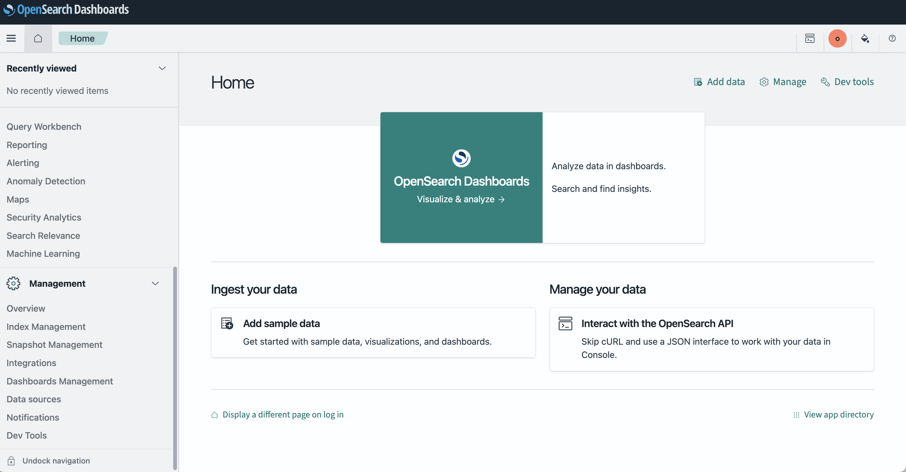
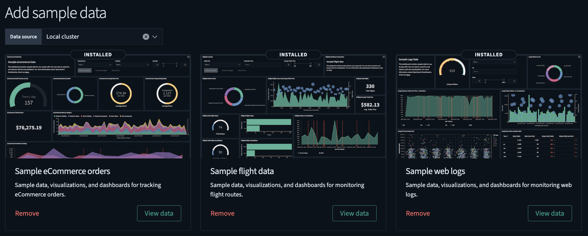
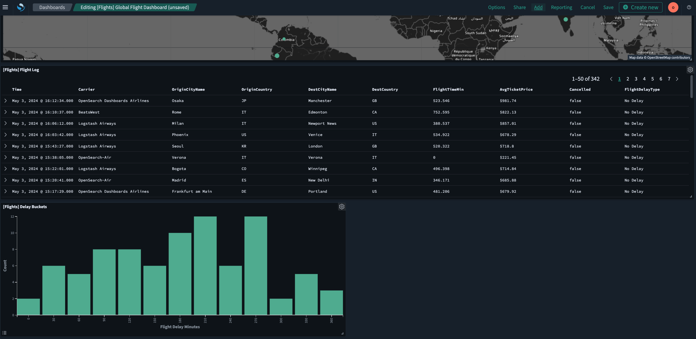
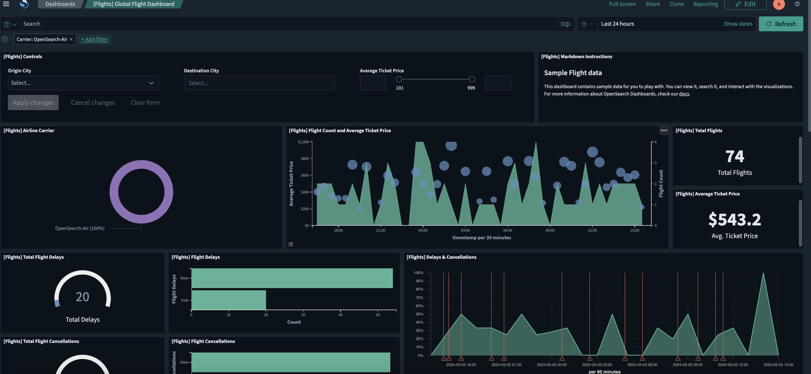

# OpenSearch Dashboards quickstart guide
- **Adding sample data**: Use preloaded visualizations, dashboards, and other tools to explore OpenSearch Dashboards before adding your own data.
- **Using the Discover application**: Analyze your data to gain insights.
- **Using the Dashboards application**: Create and store data visualizations.
- **Customizing the appearance theme**: Quickly change the OpenSearch Dashboards appearance theme from the home page.

Default view:  

## Adding sample data
To add sample data, follow these steps:

- On the OpenSearch Dashboards Home page, choose **Add sample data**. Alternatively, choose **Add data** on the upper-right toolbar.
- On the **Add sample data** page, choose the dataset(s) you want to add to Dashboards. The following image shows the available sample datasets.

## Using the Discover application
To use the Discover application, follow these steps:

1. From the OpenSearch Dashboards navigation menu, choose **Discover**.
2. On the Discover page, choose the index pattern `opensearch_dashboards_sample_data_flights` from the dropdown menu on the upper left.
3. Select the calendar icon to change the time filter from the default of **Last 15 minutes** to **Last 7 days**.
4. In the DQL search bar, enter `FlightDelay:true AND DestCountry: US AND FlightDelayMin >= 60` and select **Update**. Results are shown for US-bound flights delayed by 60 minutes or more.
5. Filter data by selecting **Add filter** from the DQL search bar and then selecting a **Field**, **Operator**, and **Value** from the dropdown lists in the Edit Filter pop-up window. For example, select `FlightDelayType`, `is`, and `Weather Delay`.

## Using the Dashboards application
With Dashboards, you can:

- Display data in a single view.
- Build dynamic dashboards.
- Create and share reports.
- Embed analytics to differentiate your applications.

The Dashboards application creates and stores visualizations generated from your data. Follow these steps to use the application:

1. On the OpenSearch Dashboards Home page, choose **Dashboards**. A list of dashboards generated from the sample data appears.
2. In the search toolbar, search for and select **[Flights] Global Flight Dashboard**. You’ll see a dashboard preloaded with visualizations, including charts, maps, and data tables.
3. To add other panels to the dashboard, select the **Edit** button and then choose **Add** from the toolbar. The Add panels window opens.
4. In the search toolbar in the Add panels window, search for and select the existing panel **[Flights] Delay Buckets**. A pop-up message confirms that you’ve added the panel.
5. Select **close x** to exit the Add panels window. The newly added panel is now displayed as the last panel on the dashboard.

The resulting view is shown in the following image.

## Interacting with data using dashboards

- In the dashboard toolbar, choose Add filter.
- From the Field, Operator, and Value dropdown lists, choose Carrier, is, and OpenSearch-Air, respectively.
- Choose Save. The dashboard updates automatically.

Resulting view:  

## Changing the appearance theme settings
- Navigate to Management > Dashboards Management > Advanced Settings.
- Scroll to the Appearance section and toggle theme:darkMode on or off.
- Select the Save changes button and then the Reload button. The updated theme is applied immediately.

## Opensearch Assistant
The OpenSearch Assistant toolkit helps you create AI-powered assistants for OpenSearch Dashboards without requiring you to have specialized query tools or skills.

See `machine_learning` topic for further information