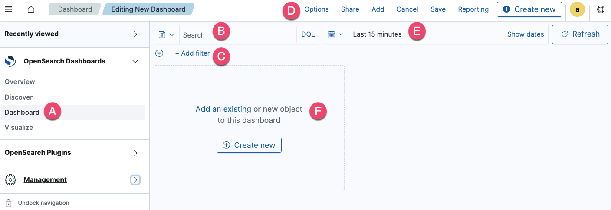

# Creating Dashboards
- The Dashboard application in OpenSearch Dashboards lets you visually represent your analytical, operational, and strategic data to help you quickly understand the trends in your data.
- It provides a high-level view of key metrics, simplifies data exploration, and delivers insights when and where you need them.

## Getting familiar with the UI
  

- The navigation panel (A) on the left contains the OpenSearch Dashboards applications.
- The search bar (B) lets you search for documents and other objects and add filters.
- The filter (C) lets you narrow a dashboard’s results.
- The toolbar (D) contains frequently used commands and shortcuts.
- The time filter (E) lets you customize the time and date.
- The panel (F) allows you to add existing visualizations to the dashboard or create new ones for the dashboard.

## Creating a dashboard and adding an existing visualization

## Creating visualizations

## Adding subsequent panels

## Saving dashboards

## Customizing the look of a panel

## Arranging panels

## Visualizations

| Name          | Description                                                                 | Use Cases                                                                                       | image_url                                      |
|---------------|-----------------------------------------------------------------------------|------------------------------------------------------------------------------------------------|------------------------------------------------|
| Area charts   | Depict changes over time, showing trends and patterns in log data.         | Analyzing sales data over time, identifying trends.                                          |  |
| Bar charts    | Compare categorical data and depict changes over time.                     | Visualizing sales by category, comparing performance metrics.                                 |    |
| Controls       | Panels for filtering data on dashboards.                                   | Adding interactive inputs for user-driven data exploration.                                   |      |
| Data tables   | Show raw data in tabular form.                                            | Presenting detailed records, exporting data for analysis.                                     |  |
| Gantt charts  | Show start, end, and duration of events in a sequence.                    | Trace analytics, telemetry, and anomaly detection.                                            |  |
| Gauge charts  | Display measurements like an analog speedometer.                           | Tracking performance against benchmarks or goals.                                             |  |
| Heat maps     | Represent distribution of numerical data over time using colors.          | Analyzing frequency of events across time intervals.                                          |      |
| Line charts   | Compare changes in measured values over time.                              | Monitoring sales trends month-over-month.                                                     |   |
| Maps          | Visualize location-based data using coordinate and region maps.            | GPS data visualization, geographic trend analysis.                                            |               |
| Markdown      | Markup language for providing context to visualizations.                   | Displaying information and instructions alongside visualizations.                             |       |
| Metric values | Compare values in different measures, such as actual vs goal sales.       | Performance tracking against targets.                                                          |  |
| Pie charts    | Compare values for items in a dimension as a percentage of a total amount.| Visualizing market share or distribution of resources.                                        |     |
| TSVB          | Tool for creating detailed time-series visualizations.                     | Analyzing flight delays or statuses over time.                                               |               |
| Tag cloud     | Display word frequency in relation to other words in a dataset.           | Analyzing keyword usage or content popularity.                                               |     |
| Timeline      | Create time-series visualizations similar to TSVB but with a different approach.| Visualizing event sequences over time.                                                        |       |
| VisBuilder    | Drag-and-drop tool for immediate visualization creation without preselection.| Quick visual analysis without complex setup processes.                                         |   |
| Vega          | Declarative language for creating interactive visualizations.              | Customizing visualizations using any Dashboards visualization type.                           |               |