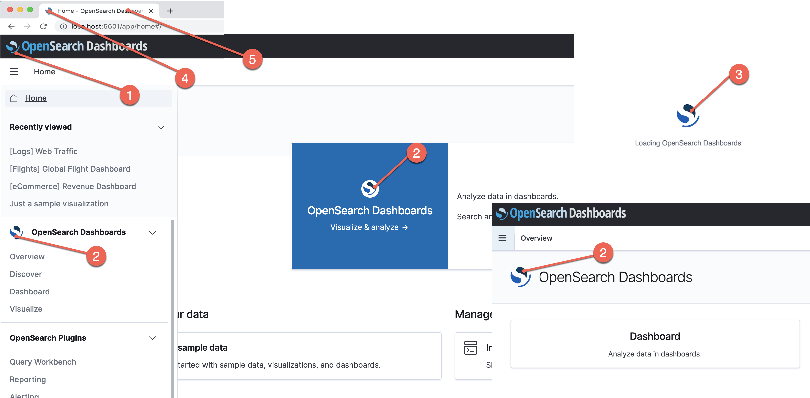

# Custom branding
By default, OpenSearch Dashboards uses the OpenSearch logo, but if you want to use custom branding elements such as the favicon or main Dashboards logo, you can do so by editing `opensearch_dashboards.yml` or by including a custom `opensearch_dashboards.yml` file when you start your OpenSearch cluster.

## Branding elements


| Setting           | Corresponding branding element                                                                 |
|-------------------|------------------------------------------------------------------------------------------------|
| `logo`            | Header logo. See #1 in the image.                                                              |
| `mark`            | OpenSearch Dashboards mark. See #2 in the image.                                               |
| `loadingLogo`     | Loading logo used when OpenSearch Dashboards is starting. See #3 in the image.                 |
| `faviconUrl`      | Website icon. Loads next to the application title. See #4 in the image.                        |
| `applicationTitle`| The application’s title. See #5 in the image.                                                  |

To start using your own branding elements in OpenSearch Dashboards, first uncomment this section of opensearch_dashboards.yml:

```yaml
# opensearchDashboards.branding:
  # logo:
    # defaultUrl: ""
    # darkModeUrl: ""
  # mark:
    # defaultUrl: ""
    # darkModeUrl: ""
  # loadingLogo:
    # defaultUrl: ""
    # darkModeUrl: ""
  # faviconUrl: ""
  # applicationTitle: ""
```

Valid image types are `SVG`, `PNG`, and `GIF`

>We recommend linking to images that are hosted on a web server, but if you really want to use locally hosted images, save your images inside assets, and then configure opensearch_dashboards.yml to use the correct paths. You can access locally stored images through the ui/assets folder.