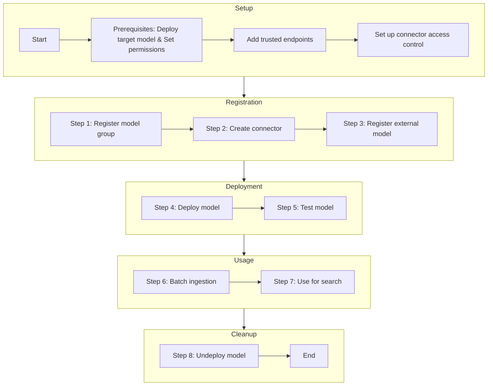

```mermaid
flowchart TD

    subgraph Setup
        direction LR
        A[Start] --> B[Prerequisites: Deploy target model & Set permissions] --> C[Add trusted endpoints] --> D[Set up connector access control]
    end

    subgraph Registration
        direction LR
        E[Step 1: Register model group] --> F[Step 2: Create connector] --> G[Step 3: Register external model]
    end

    subgraph Deployment
        direction LR
        H[Step 4: Deploy model] --> I[Step 5: Test model]
    end

    subgraph Usage
        direction LR
        J[Step 6: Batch ingestion] --> K[Step 7: Use for search]
    end

    subgraph Cleanup
        direction LR
        L[Step 8: Undeploy model] --> M[End]
    end

    Setup --> Registration
    Registration --> Deployment
    Deployment --> Usage
    Usage --> Cleanup
```